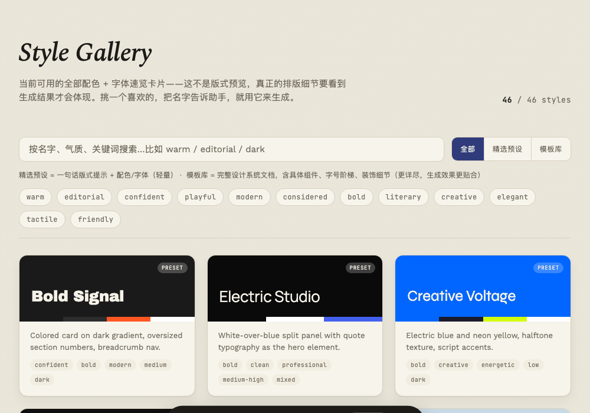
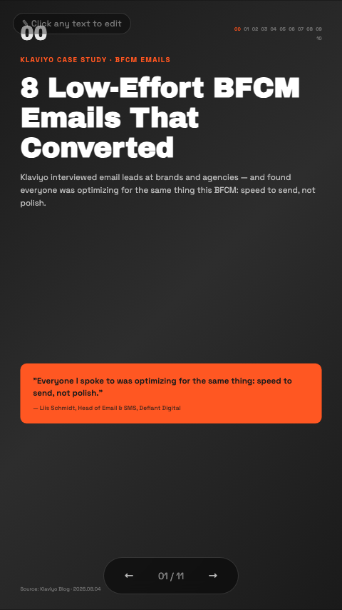
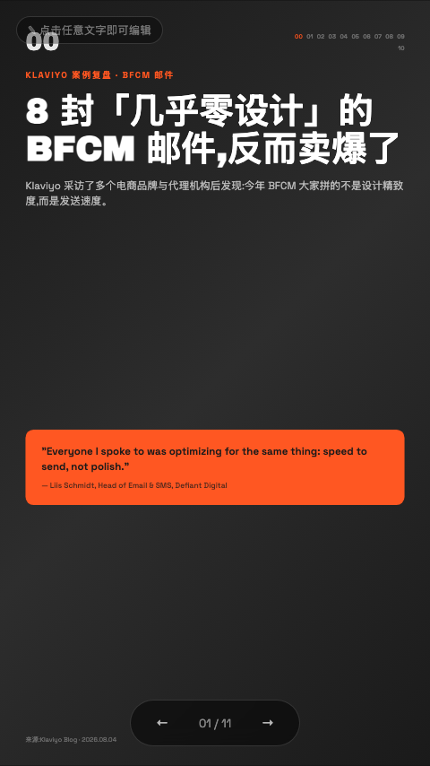
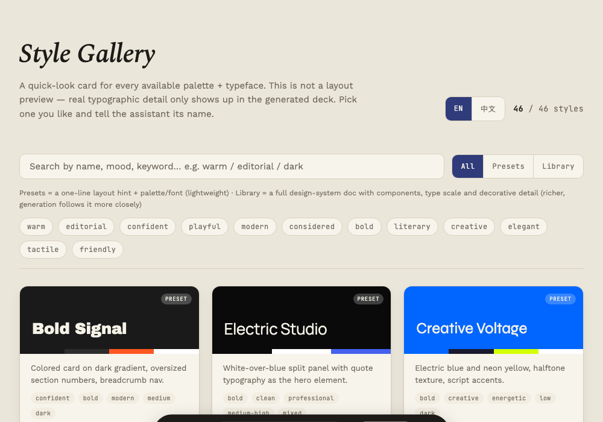

# Show Anywhere PPT (Mia)

**Make presentations that look designed, run anywhere, and fit a phone screen.**

An agent skill for [Claude Code](https://claude.com/claude-code) and [OpenAI Codex CLI](https://developers.openai.com/codex/cli). Give it a topic, an article, a PDF, or a `.pptx` — pick a look from a visual gallery — get back a single self-contained HTML file you can open in any browser, edit by clicking on the text, and share as a link.

<p align="center">
  
</p>

## Why this one · 为什么选它

**📱 Portrait by default.** The canvas is 1080×1920 (9:16) unless you ask for widescreen. Most decks get read on a phone now, not projected — and the skill *re-authors* landscape design systems into vertical layouts instead of squashing them.<br>
**竖屏优先。** 默认 1080×1920（9:16）画布，为手机阅读而生；横屏设计系统会被真正重排成竖版，而不是简单压缩。

**🎨 You pick the look by seeing it.** 46 complete design systems, rendered as a searchable gallery with an EN/中 toggle — real palettes in their real display fonts. Choose by sight, not by typing "modern but warm" and hoping.<br>
**看着挑风格。** 46 套完整设计系统渲染成可搜索的画廊，界面与卡片介绍支持中英一键切换——用眼睛选，不靠形容词碰运气。

**✍️ Click any text to edit it.** No edit mode, no button to hunt for. Every text element is editable the moment the deck loads; changes autosave in your browser.<br>
**点字即改。** 没有编辑模式开关，打开就能改，改动自动保存在浏览器里。

**🀄 Chinese that doesn't look machine-made.** Full-width punctuation, proper CJK line-height, no uppercase transforms on Hanzi, spacing between Hanzi and Latin runs.<br>
**不像机器排的中文。** 全角标点、合适的中文行高、汉字不做大写转换、中西文之间留空隙。

**📦 One file, zero dependencies.** Inline CSS/JS, images embedded as data URIs. Email it, host it, open it offline.<br>
**单文件零依赖。** CSS/JS 全部内联，图片内嵌，随发随开，离线可用。

**📤 HTML or PDF, your call.** PDF export reads the deck's own canvas size — portrait decks come out as portrait pages, no flag to remember.<br>
**HTML 或 PDF 随你选。** PDF 导出自动识别画布方向，竖屏 deck 导出就是竖版页面。

## See it in action · 实际效果

Same [Klaviyo article](https://www.klaviyo.com/blog/low-effort-bfcm-emails), same **Bold Signal** style, same 9:16 mobile canvas — one deck in English, one in 中文. Every text is click-to-edit; the email screenshots were pulled straight from the source article.<br>
同一篇 [Klaviyo 博客](https://www.klaviyo.com/blog/low-effort-bfcm-emails)，同一个 **Bold Signal** 风格，同一个 9:16 手机画布——分别用英文和中文各生成一份。文字点击即改，配图直接从原文抓取。

<table>
  <tr>
    <td width="50%" align="center"><strong>English</strong></td>
    <td width="50%" align="center"><strong>中文</strong></td>
  </tr>
  <tr>
    <td align="center"></td>
    <td align="center"></td>
  </tr>
</table>

## Install

The skill is one folder. Drop it where your agent looks for skills.

### Claude Code

```bash
git clone https://github.com/miazheng-max/show-anywhere-mia.git ~/.claude/skills/show-anywhere-mia
```

Then invoke it with `/show-anywhere-mia`, or just ask for a deck and it will trigger on its own.

### Codex CLI

```bash
git clone https://github.com/miazheng-max/show-anywhere-mia.git ~/.codex/skills/show-anywhere-mia
```

For a project-local install, use `.codex/skills/show-anywhere-mia` inside the repo instead. Codex also reads `~/.agents/skills/` if you keep skills shared across agents.

### Requirements

- Python 3.8+ — standard library only for generating decks and the gallery

Optional, only for the feature that needs it:

| Feature | Needs |
| --- | --- |
| `.pptx` conversion | `pip install python-pptx` |
| PDF export | `pip install playwright && python3 -m playwright install chromium` |
| Publish to a URL | Node.js + a free [Vercel](https://vercel.com) account |

No other companion skill is required. Everything the skill reads is inside this repo.

## Easy to go · 四个问题就开始

Answer four questions and the deck gets made. The assistant asks them in your language.
回答四个问题,deck 就开始生成。助手会用你的语言提问。

| # | Question · 问题 | Options · 选项 |
|---|---|---|
| 1 | **Purpose** · 用途 | Marketing · 营销 / Training · 培训讲解 / Talk · 演讲 / Internal · 内部汇报 |
| 2 | **Density** · 密度 | Detail-rich pages · 细节完整可自行阅读 / Concise for speaking · 演讲精简 |
| 3 | **Style** · 配色 | Browse the 46-style gallery, copy the name back · 在画廊里挑一个,把名字复制回来 |
| 4 | **Output** · 交付 | **HTML (recommended · 推荐,可继续点字编辑)** / PDF (downloadable · 可下载) |

Behind the scenes: the deck defaults to portrait 9:16, slide count is derived from your content, and every slide is verified for overflow and broken images before delivery.
默认竖屏 9:16,页数根据内容自动决定,交付前每一页都会检查溢出与图片加载。

Question 3 is the point. The gallery is a real HTML page with search, mood filters, a preset/library toggle, and an EN/中 switch:

<p align="center">
  
</p>

## What's in the box

| | |
| --- | --- |
| **12 curated presets** | Bold Signal, Electric Studio, Creative Voltage, Dark Botanical, Notebook Tabs, Pastel Geometry, Split Pastel, Vintage Editorial, Neon Cyber, Terminal Green, Swiss Modern, Paper & Ink |
| **34 full design systems** | Complete design docs — palette, type scale, component grammar, CJK pairings — for templates like Cobalt Grid, Biennale Yellow, Retro Zine, Emerald Editorial, Sakura Chroma, and 29 more |

Each design system is a full specification, not a color preset — which is why a generated deck holds together across title, section, data, quote, and closing slides instead of drifting.

## Repo layout

```
show-anywhere-mia/
├── SKILL.md                       # the skill itself
├── template-pack/
│   ├── selection-index.json       # compact metadata for all 34 systems
│   └── templates/<slug>/
│       ├── design.md              # full design system
│       └── preview.md             # lightweight style card
├── reference/
│   ├── STYLE_PRESETS.md           # the 12 curated presets
│   ├── viewport-base.css          # mandatory fixed-stage CSS
│   ├── html-template.md           # HTML/JS architecture
│   └── animation-patterns.md      # animation snippets by feeling
├── scripts/
│   ├── render-gallery.py          # renders the style gallery
│   ├── build-gallery-data.py      # extracts palettes/fonts from design docs
│   ├── extract-pptx.py            # .pptx → text + images
│   ├── export-pdf.py              # deck → PDF, auto-detects canvas size
│   └── deploy.sh                  # deck → public URL (asks first)
├── assets/
│   └── gallery-template.html      # gallery shell
└── docs/
    ├── demo.gif                   # the README demo
    ├── demo-deck.html             # the 3-slide sample deck in the demo
    └── capture-demo.py            # regenerates the GIF (needs playwright)
```

## Try the gallery on its own

You don't need an agent to look at the styles:

```bash
python3 scripts/render-gallery.py /tmp/style-gallery.html && open /tmp/style-gallery.html
```

## Credits

Built on two MIT-licensed projects by [Zara Zhang](https://github.com/zarazhangrui):

- [**frontend-slides**](https://github.com/zarazhangrui/frontend-slides) — the fixed-stage layout model, style presets, and anti-AI-slop design philosophy this skill is built around.
- [**beautiful-html-templates**](https://github.com/zarazhangrui/beautiful-html-templates) — the 34 bundled design systems.

`show-anywhere-mia` bundles these into a single self-contained skill and adds the visual style gallery, portrait-first defaults, cross-agent portability, expanded CJK typography, and always-on inline editing. See [NOTICE](NOTICE) for exactly what was taken and what was changed.

## License

[MIT](LICENSE).
